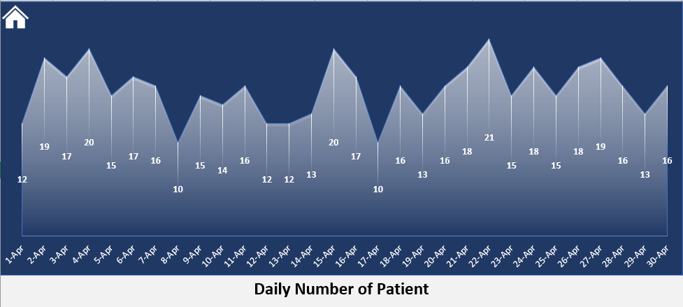

# Excel-Hospital-Emergency-Room  
This interactive Power BI dashboard provides a comprehensive monthly overview of emergency room performance. It includes key metrics such as:  
* Total Patients  
* Average Wait Time  
* Patient Satisfaction Score  
* Admission vs. Non-Admission Rates  
* Patient Attendance Status (On-time vs. Delayed)  
* Gender and Age Group Distribution  
* Department Referral Breakdown

  DASHBOARD
  

  

    

    
